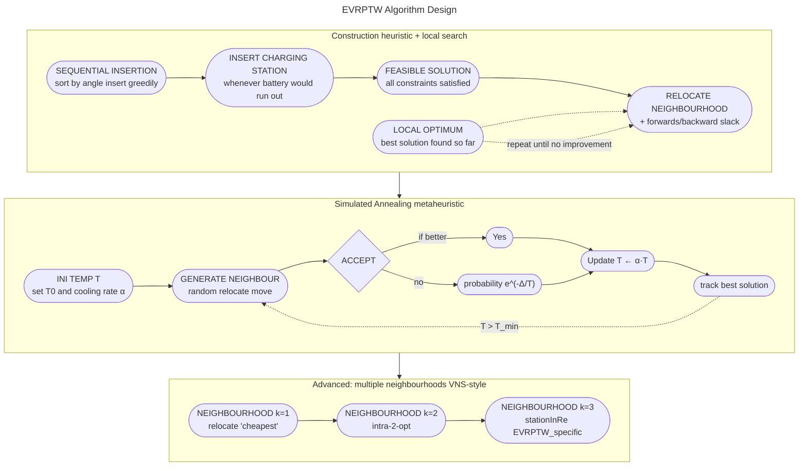

**Electric-Vehicle Routing Problem with Time Window** (EVRPTW)

## Problem Definition

| Variables|
| ------|
| **complete directed graph** $G = (V, A)$:<br> • nodes $V$:<br>  – customers $c \in V^c$, each customer $i$ has:<br>   ▪ positive demand $q_i$<br>   ▪ service time $s_i$<br>  – charging stations $f \in V^f$<br> • edges $A$: each edge $(i,j) \in A$ has:<br>  – distance $d_{ij}$<br>  – travel time $t_{ij}$ |
| **set of $k$ identical vehicles** $k \in K$:<br> • each vehicle has capacity $C$ and is **fully loaded at the |
| **time window** $[e_i, l_i]$:<br> • service must start within $[e_i, l_i]$ (starts at $e_i$) but can finish later than $l_i$|
| **charging rate** $g$:<br> • $Q$ = maximum battery capacity<br> • current charge $y$<br> • charging time: $g \cdot (Q - y)$ [charging rate × remaining capacity]<br> • at the charging station it charges to **full** (we can visit a station more than once)  |
| **energy consumption rate** $r$:<br> • energy consumption for edge $(i,j)$: $r \cdot d_{ij}$ |

### Goal

Construct routes that:

- serve all customers exactly once
- minimise the total travel distance (reduces the possibility of recharging to increase the range)

### Constraints

- all routes must start and end at the depot
- all customers must be served
- vehicle load capacity
- battery capacity
- battery charge can never fall below zero
- time window constraints

### Assumptions

- flat terrain
- constant travel speed

---
## Instances

|  |  |
| --- | --- |
| ‘StringID’ | used at the end to show the constructed solution |
| ‘Type’ | used to fast identify the node type (‘d’: depot, ‘f’: charging station, ‘c’: customer) |
| (x, y) | the node coordinates |
| ‘demand’ | how much cargo this node needs |
| ‘ReadyTime’ $e_{i}$ | earliest time the vehicle may arrive at this node. If it arrives earlier, it waits |
| ‘DueDate’ $l_{i}$ | latest time the vehicle may **begin service** at this node. Arriving after this = time window violation |
| ‘ServiceTime’ $s_{i}$ | how long the vehicle spends at the node after arriving (this is **not** the charge time) |
### Data Structure

the data is taken from the instances files and store them in custom data type `Node`

```python
@dataclass()
class Node:
    id: str
    type : str
    x: float
    y: float
    demand: float
    ready: float
    due: float
    service: float
```

---

## Implementation



---

## How to Run 

1.  clone the app
    
    ```sh
    git clone https://github.com/rami-shalhoub/EVRPTW.git
    cd ./EVRPTW
    ```
2.  setup python environment
    
    ```sh
    python -m venv .env
    source ./.env/bin/activate
    pip install -r requirements.txt
    ```
3.  run the app
    
    ```sh
    python main.py
    ```
    
    or check the option with `python main.py --help`
4.  check the data
    
    ```sh
    python validate_all.py --solution-dir ./solution --instance-dir ./resources/instances
    ```
5.  run `shiny`
    
    ```sh
    shiny run
    ```